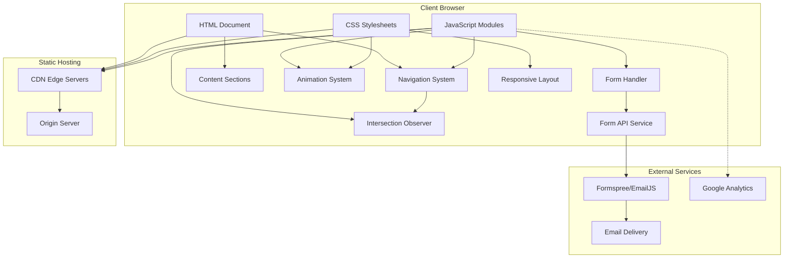

# Design Document: LF Digital Solutions Portfolio Website

## Overview

### Purpose

This document specifies the technical design for the LF Digital Solutions portfolio and marketing website—a modern, single-page application that serves as the primary digital presence for a 2-person digital solutions company. The website showcases services, projects, and brand identity to attract clients including businesses, startups, agricultural organizations, educational institutions, and students.

### Design Philosophy

The design prioritizes **performance, accessibility, and maintainability** while delivering a premium, non-generic user experience. Key design principles include:

1. **Progressive Enhancement**: Core content accessible without JavaScript, enhanced interactions with JavaScript enabled
2. **Performance First**: Lighthouse scores of 90+ (desktop) and 80+ (mobile) as architectural constraints
3. **Vanilla-First Approach**: Use native browser APIs and vanilla JavaScript to minimize bundle size and maximize performance
4. **Semantic HTML**: Proper document structure for SEO and accessibility
5. **Mobile-First Responsive**: Design scales from 320px to 3840px viewport widths

### Technology Stack Rationale

**Frontend**: Vanilla HTML, CSS, and JavaScript
- **Why not React/Vue/Angular?** For a single-page portfolio with limited interactivity, framework overhead (300KB+ for React) is unjustified. Research shows vanilla JavaScript delivers better performance, smaller bundle sizes, and demonstrates technical skill for a portfolio showcasing web development capabilities.
- **Trade-offs**: Sacrifices component reusability but gains load performance, simplicity, and direct control over optimizations.

**CSS Approach**: Custom CSS with CSS Variables and modern features
- Leverages CSS Grid, Flexbox, CSS scroll-behavior, and CSS custom properties
- No preprocessor needed for this scope; variables provide sufficient dynamic theming

**Form Backend**: Formspree or EmailJS
- **Rationale**: Third-party form service eliminates need for backend infrastructure, provides spam filtering, and ensures reliable delivery
- **Alternative considered**: Custom backend with serverless function—rejected due to maintenance overhead for a 2-person team

**Hosting**: Static hosting (Netlify, Vercel, or GitHub Pages)
- Aligns with static site architecture
- Provides automatic HTTPS, CDN distribution, and simple deployment workflow

## Architecture

### System Architecture



### Module Structure

The application is organized into logical modules:

```
/
├── index.html                 # Main HTML document
├── css/
│   ├── reset.css             # CSS reset/normalization
│   ├── variables.css         # CSS custom properties (colors, spacing, etc.)
│   ├── layout.css            # Layout and grid systems
│   ├── components.css        # Reusable component styles
│   ├── sections.css          # Section-specific styles
│   └── animations.css        # Animation and transition definitions
├── js/
│   ├── navigation.js         # Navigation and scroll management
│   ├── animations.js         # Intersection Observer and animation triggers
│   ├── form.js               # Contact form validation and submission
│   └── analytics.js          # Analytics integration
├── assets/
│   ├── images/               # Optimized images
│   ├── logo.svg              # Company logo
│   └── patterns/             # Tech/network pattern assets
├── robots.txt                # Search engine directives
├── sitemap.xml               # XML sitemap
└── manifest.json             # Web app manifest
```

### Page Structure

Single-page layout with four main sections:

1. **Hero Section** (Home): Company branding, tagline, value proposition
2. **Services Section**: Four service offerings with descriptions
3. **Projects Section**: Portfolio showcase with placeholder structure
4. **About Us Section**: Team information and company details
5. **Contact Section**: Contact form and contact information

### Navigation Architecture

**Smooth Scroll Implementation**:
- **CSS-based**: `scroll-behavior: smooth` for anchor link clicks
- **JavaScript enhancement**: Custom scrolling with `scrollIntoView({ behavior: 'smooth', block: 'start' })` for programmatic navigation
- **Browser history integration**: Hash-based routing with `history.pushState()` for back/forward button support

**Active Section Highlighting**:
- **Intersection Observer API**: Observes section visibility in viewport
- **Threshold configuration**: Trigger at 50% intersection ratio to handle sections of varying heights
- **Navigation state management**: Updates active class on navigation links as sections enter/exit viewport

## Components and Interfaces

### Navigation System

**Responsibilities**:
- Smooth scrolling to target sections
- Active section highlighting
- Mobile menu toggle (hamburger menu for viewports < 768px)
- Browser history management

**Interface**:
```javascript
class NavigationSystem {
  constructor(navElement, sections)
  
  // Scroll to a specific section
  scrollToSection(sectionId: string): void
  
  // Set up Intersection Observer for active state
  initializeObserver(): void
  
  // Update active navigation item
  updateActiveLink(sectionId: string): void
  
  // Toggle mobile menu
  toggleMobileMenu(): void
  
  // Handle browser history navigation
  handlePopState(event: PopStateEvent): void
}
```

**Key Behaviors**:
- Smooth scrolling completed within 800ms (Requirement 1.2)
- Intersection Observer with `threshold: 0.5` and `rootMargin: '-100px 0px -50% 0px'` to determine active section
- Debounced scroll listeners to minimize performance impact

### Animation System

**Responsibilities**:
- Trigger animations as sections enter viewport
- Hover state animations for interactive elements
- Respect `prefers-reduced-motion` user preference

**Interface**:
```javascript
class AnimationSystem {
  constructor(options)
  
  // Initialize Intersection Observer for scroll animations
  observeElements(elements: NodeList): void
  
  // Check motion preferences
  shouldAnimate(): boolean
  
  // Trigger animation on element
  animateElement(element: HTMLElement, animationType: string): void
}
```

**Animation Types**:
1. **Fade-in**: Opacity transition for section content
2. **Slide-up**: Transform translateY for cards and content blocks
3. **Hover effects**: Scale, shadow, and color transitions for buttons and cards

**Performance Considerations**:
- Use `transform` and `opacity` for animations (GPU-accelerated)
- Avoid layout-thrashing properties (width, height, top, left)
- Target 60fps with `will-change` hint for animated elements
- Remove `will-change` after animation completes to free GPU resources

### Contact Form Component

**Responsibilities**:
- Client-side validation
- Form submission to backend service
- User feedback (success, error, loading states)
- Data preservation on submission failure

**Interface**:
```javascript
class ContactForm {
  constructor(formElement, apiEndpoint)
  
  // Validate form fields
  validateField(field: HTMLInputElement): ValidationResult
  
  // Validate entire form
  validateForm(): boolean
  
  // Submit form data
  async submitForm(formData: FormData): Promise<SubmissionResult>
  
  // Display feedback message
  showMessage(type: 'success' | 'error' | 'loading', message: string): void
  
  // Preserve form data
  preserveFormData(): void
  
  // Clear form after success
  clearForm(): void
}
```

**Validation Rules**:
- **Name field**: Required, minimum 2 characters
- **Email field**: Required, RFC 5322 email format validation using regex pattern
- **Message field**: Required, minimum 10 characters
- Real-time validation on blur, final validation on submit

**API Integration**:
- **Formspree endpoint**: `https://formspree.io/f/{form_id}`
- **Request method**: POST with JSON or form-encoded data
- **Timeout**: 5 seconds with error handling
- **Rate limiting**: Respect service rate limits (typically 50 requests/month on free tier)

### Project Showcase Component

**Responsibilities**:
- Display project cards in responsive grid
- Handle 0-10 project entries gracefully
- Support placeholder content structure

**Interface**:
```javascript
class ProjectShowcase {
  constructor(containerElement, projects)
  
  // Render project grid
  renderProjects(projects: Project[]): void
  
  // Render single project card
  renderProjectCard(project: Project): HTMLElement
  
  // Handle empty state
  renderEmptyState(): HTMLElement
}

interface Project {
  id: string
  title: string
  description: string
  imageUrl: string
  tags: string[]
  link?: string
}
```

**Layout Behavior**:
- CSS Grid with `auto-fit` and `minmax()` for responsive columns
- 3 columns on desktop (≥1200px), 2 columns on tablet (768px-1199px), 1 column on mobile (<768px)
- Maintains aspect ratio for project images using `aspect-ratio` CSS property

### Responsive Layout System

**Breakpoint Strategy**:
```css
/* Mobile-first breakpoints */
:root {
  --breakpoint-sm: 576px;   /* Large phones */
  --breakpoint-md: 768px;   /* Tablets */
  --breakpoint-lg: 1024px;  /* Small laptops */
  --breakpoint-xl: 1280px;  /* Desktops */
  --breakpoint-xxl: 1920px; /* Large displays */
}
```

**Responsive Patterns**:
1. **Navigation**: Horizontal links (≥768px) → Hamburger menu (<768px)
2. **Service Cards**: 4 columns → 2 columns → 1 column
3. **Typography**: Fluid typography using `clamp()` function
4. **Spacing**: Fluid spacing scale responsive to viewport width

**Touch Target Requirements**:
- Minimum 44x44px touch targets on mobile (Requirement 2.4)
- Additional padding on buttons and links for mobile viewports

## Data Models

### Site Content Model

Content is structured as JavaScript objects for easy maintenance:

```javascript
const siteContent = {
  company: {
    name: "L.F Digital Solutions",
    tagline: "WE BUILD, YOU GROW",
    message: "WE BUILD THE WEBSITES YOU WANT",
    logo: "/assets/logo.svg"
  },
  
  team: [
    {
      name: "Arianne Faith S. Panes",
      role: "Creative Designer",
      email: "ariannefaith.panes.art@gmail.com"
    },
    {
      name: "Charles Louis C. David",
      role: "Developer",
      email: "charleslouis.david.dev@gmail.com"
    }
  ],
  
  contact: {
    location: "San Antonio, Roxas Ext. Digos City, Davao del Sur",
    phones: ["0966 759 0644", "0967 470 1338"],
    emails: ["ariannefaith.panes.art@gmail.com", "charleslouis.david.dev@gmail.com"]
  },
  
  services: [
    {
      id: "website-development",
      title: "Website Development",
      description: "Custom websites designed to showcase your brand, strengthen your online presence, and help your business grow",
      icon: "icon-website"
    },
    {
      id: "business-systems",
      title: "Custom Business Systems",
      description: "Inventory, POS, booking, management, and other web-based solutions built for your needs",
      icon: "icon-system"
    },
    {
      id: "branding-design",
      title: "Branding & Creative Design",
      description: "Logos, UI/UX design, social media graphics, posters, and marketing materials",
      icon: "icon-design"
    },
    {
      id: "custom-solutions",
      title: "Custom Digital Solutions",
      description: "Tailored to client needs",
      icon: "icon-custom"
    }
  ],
  
  targetAudiences: [
    "Businesses and Startups",
    "Farm and Agri-Businesses",
    "Organizations and NGOs",
    "Schools and Institutions",
    "Students (Portfolio Websites, Capstone Systems, Thesis Systems, School Organization Websites)"
  ]
}
```

### Brand Theme Model

Visual identity defined through CSS custom properties:

```css
:root {
  /* Brand Colors */
  --color-primary: #1E3A8A;        /* Royal Blue */
  --color-primary-light: #3B82F6;  /* Tech Blue */
  --color-primary-dark: #1E40AF;   /* Deep Blue */
  
  --color-secondary: #0F172A;      /* Dark Navy */
  --color-secondary-light: #1E293B;
  
  --color-accent: #60A5FA;         /* Accent Blue */
  
  /* Neutral Colors */
  --color-white: #FFFFFF;
  --color-gray-100: #F1F5F9;
  --color-gray-200: #E2E8F0;
  --color-gray-700: #334155;
  --color-gray-900: #0F172A;
  
  /* Semantic Colors */
  --color-success: #10B981;
  --color-error: #EF4444;
  --color-warning: #F59E0B;
  
  /* Typography */
  --font-primary: 'Inter', system-ui, -apple-system, sans-serif;
  --font-heading: 'Poppins', var(--font-primary);
  
  /* Spacing Scale */
  --space-xs: 0.25rem;   /* 4px */
  --space-sm: 0.5rem;    /* 8px */
  --space-md: 1rem;      /* 16px */
  --space-lg: 1.5rem;    /* 24px */
  --space-xl: 2rem;      /* 32px */
  --space-2xl: 3rem;     /* 48px */
  --space-3xl: 4rem;     /* 64px */
  
  /* Border Radius */
  --radius-sm: 0.25rem;
  --radius-md: 0.5rem;
  --radius-lg: 1rem;
  
  /* Transitions */
  --transition-fast: 150ms ease-in-out;
  --transition-base: 300ms ease-in-out;
  --transition-slow: 500ms ease-in-out;
}
```

### Form Data Model

```javascript
interface ContactFormData {
  name: string          // Required, min 2 chars
  email: string         // Required, valid email format
  message: string       // Required, min 10 chars
  timestamp: number     // Submission timestamp
  honeypot?: string     // Anti-spam honeypot field (should be empty)
}

interface FormValidationResult {
  isValid: boolean
  errors: {
    [fieldName: string]: string
  }
}

interface FormSubmissionResult {
  success: boolean
  message: string
  error?: Error
}
```

### Analytics Event Model

```javascript
interface AnalyticsEvent {
  eventCategory: 'navigation' | 'form' | 'interaction'
  eventAction: string
  eventLabel?: string
  eventValue?: number
}

// Example events:
const analyticsEvents = {
  sectionView: (sectionId) => ({
    eventCategory: 'navigation',
    eventAction: 'section_view',
    eventLabel: sectionId
  }),
  
  formSubmit: (success) => ({
    eventCategory: 'form',
    eventAction: success ? 'submit_success' : 'submit_error'
  }),
  
  navClick: (target) => ({
    eventCategory: 'interaction',
    eventAction: 'nav_click',
    eventLabel: target
  })
}
```

### SEO Metadata Model

```javascript
const seoMetadata = {
  title: "L.F Digital Solutions | Custom Websites & Digital Solutions in Digos City",
  description: "Professional website development, custom business systems, and branding services for businesses, organizations, and students in Digos City, Davao del Sur.",
  keywords: [
    "web development Digos City",
    "website design Davao del Sur",
    "custom business systems Philippines",
    "branding services Mindanao",
    "student portfolio websites"
  ],
  openGraph: {
    type: "website",
    locale: "en_PH",
    url: "https://lfdigitalsolutions.com",
    siteName: "L.F Digital Solutions",
    title: "L.F Digital Solutions | Custom Websites & Digital Solutions",
    description: "We build custom websites, business systems, and branding solutions tailored to your needs.",
    image: "/assets/og-image.jpg"
  },
  structuredData: {
    "@context": "https://schema.org",
    "@type": "Organization",
    "name": "L.F Digital Solutions",
    "url": "https://lfdigitalsolutions.com",
    "logo": "https://lfdigitalsolutions.com/assets/logo.svg",
    "contactPoint": {
      "@type": "ContactPoint",
      "telephone": "+63-966-759-0644",
      "contactType": "customer service",
      "areaServed": "PH",
      "availableLanguage": ["English", "Filipino"]
    },
    "address": {
      "@type": "PostalAddress",
      "streetAddress": "San Antonio, Roxas Ext.",
      "addressLocality": "Digos City",
      "addressRegion": "Davao del Sur",
      "addressCountry": "PH"
    },
    "sameAs": [
      // Social media profiles would go here
    ]
  }
}
```


## Error Handling

### Client-Side Error Handling Strategy

**Graceful Degradation Principles**:
1. Core content accessible without JavaScript
2. Progressive enhancement for interactive features
3. Clear error messages for user-facing failures
4. Silent fallbacks for non-critical features

### Form Submission Errors

**Error Categories**:

1. **Validation Errors** (Client-side)
   - Display inline error messages next to invalid fields
   - Highlight invalid fields with red border and error icon
   - Prevent form submission until all fields valid
   - Error message format: "Field name: Error description"

2. **Network Errors** (API unreachable)
   - Display user-friendly message: "Unable to send message. Please check your connection and try again."
   - Preserve form data in browser storage (sessionStorage)
   - Provide alternative: Display email addresses as fallback contact method
   - Retry mechanism: Allow manual retry with exponential backoff (1s, 2s, 4s)

3. **Server Errors** (Formspree/EmailJS error response)
   - Display message: "Something went wrong. Please try again or contact us directly at [email]."
   - Log error to console for debugging
   - Preserve form data for retry attempt
   - Rate limit handling: Display specific message if rate limit exceeded

4. **Timeout Errors** (Request exceeds 5 seconds)
   - Display message: "Request timed out. Please try again."
   - Automatically preserve form data
   - Suggest alternative contact methods

**Error Recovery Flow**:
```javascript
async function handleFormSubmission(formData) {
  try {
    // Preserve data before submission
    preserveFormData(formData);
    
    // Show loading state
    showLoadingState();
    
    // Submit with timeout
    const response = await submitWithTimeout(formData, 5000);
    
    if (response.ok) {
      showSuccessMessage();
      clearFormData();
      clearStoredData();
    } else {
      throw new Error(`Server error: ${response.status}`);
    }
  } catch (error) {
    if (error.name === 'TimeoutError') {
      showTimeoutError();
    } else if (error.message.includes('Network')) {
      showNetworkError();
    } else {
      showGenericError();
    }
    
    // Data already preserved, keep it for retry
    enableRetryButton();
  }
}
```

### Navigation Errors

**Hash Navigation Failures**:
- If target section doesn't exist, scroll to top of page
- Log warning to console for debugging
- Remove invalid hash from URL

**Intersection Observer Unavailable** (Older browsers):
- Fallback: Use scroll event listener with throttling
- Active state based on `scrollTop` position calculation
- Maintain 60fps with requestAnimationFrame

**Smooth Scroll Unsupported**:
- Fallback to instant scroll with `scrollIntoView({ behavior: 'auto' })`
- Feature detection: Check `'scrollBehavior' in document.documentElement.style`

### Animation System Errors

**Intersection Observer Unavailable**:
- Display all content without animations
- Apply `.visible` class immediately to all animated elements
- Respect accessibility over enhancement

**Reduced Motion Preference**:
- Detect with `@media (prefers-reduced-motion: reduce)`
- Disable all animations, use instant state changes
- Maintain layout consistency without transitions

**GPU Acceleration Failures**:
- Browser automatically falls back to CPU rendering
- Monitor performance with `PerformanceObserver`
- Reduce animation complexity if frame rate drops below 30fps

### Resource Loading Errors

**Image Loading Failures**:
- Display fallback placeholder with company color gradient
- Use `` `onerror` attribute: `onerror="this.src='/assets/placeholder.svg'"`
- For logo: Display text version "L.F Digital Solutions" if image fails
- Lazy-loaded images: Show skeleton loader until loaded or error

**Font Loading Failures**:
- System font stack provides immediate fallback
- Font loading strategy: `font-display: swap` in CSS
- FOIT (Flash of Invisible Text) prevented with swap strategy

**External Service Failures** (Analytics, fonts):
- Non-blocking script loading with `async` attribute
- Site fully functional without external services
- Error logging to console only, no user-facing errors

### Browser Compatibility Errors

**Unsupported Browser Detection**:
```javascript
function detectBrowserSupport() {
  const required = {
    intersectionObserver: 'IntersectionObserver' in window,
    cssGrid: CSS.supports('display', 'grid'),
    cssVariables: CSS.supports('--test', 'value'),
    fetch: 'fetch' in window
  };
  
  const unsupported = Object.entries(required)
    .filter(([key, supported]) => !supported)
    .map(([key]) => key);
  
  if (unsupported.length > 0) {
    showBrowserWarning(unsupported);
  }
}
```

**Warning Message**:
- Display banner at top: "Your browser may not support all features. For the best experience, please update to a modern browser."
- Provide links to Chrome, Firefox, Safari, Edge downloads
- Dismissible banner stored in localStorage
- Site remains functional with graceful degradation

### Console Logging Strategy

**Development Environment**:
- Verbose logging for all events and state changes
- Error stack traces for debugging
- Performance timing logs

**Production Environment**:
- Error logging only (console.error)
- Critical warnings (console.warn)
- No verbose or debug logs
- Consider integration with error tracking service (e.g., Sentry)

**Log Levels**:
```javascript
const logger = {
  error: (message, error) => console.error(`[ERROR] ${message}`, error),
  warn: (message) => console.warn(`[WARN] ${message}`),
  info: (message) => isDevelopment && console.info(`[INFO] ${message}`),
  debug: (message, data) => isDevelopment && console.debug(`[DEBUG] ${message}`, data)
};
```

## Testing Strategy

### Testing Approach Overview

This portfolio website does **not require property-based testing** as it primarily involves UI rendering, animations, form validation, and content display—none of which benefit from testing universal properties across randomized inputs. Instead, the testing strategy focuses on:

1. **Unit Tests**: Specific validation logic and utility functions
2. **Integration Tests**: Component interactions and API integrations
3. **End-to-End Tests**: User workflows and critical paths
4. **Visual Regression Tests**: UI consistency across viewports
5. **Accessibility Tests**: WCAG 2.1 Level AA compliance
6. **Performance Tests**: Lighthouse score validation

### Why Property-Based Testing Is Not Applicable

Property-based testing (PBT) is inappropriate for this project because:

1. **UI Rendering**: The website is primarily visual presentation, which cannot be tested with universal properties
2. **No Complex Algorithms**: No parsers, serializers, or data transformations that would benefit from exhaustive input testing
3. **Configuration-Based**: Content is declarative configuration, not algorithmic logic
4. **Animation System**: Visual effects are subjective and device-dependent
5. **Form Validation**: Simple string validation rules (length, format) better tested with example-based tests

Instead, we use **example-based unit tests** for validation logic, **integration tests** for API interactions, and **E2E tests** for user workflows.

### Unit Testing

**Test Framework**: Jest (or Vitest for faster execution)

**Coverage Targets**:
- Form validation logic: 100%
- Utility functions: 100%
- Navigation logic: 90%
- Animation system: 80%

**Example Unit Tests**:

```javascript
// form.test.js
describe('ContactForm Validation', () => {
  test('validates name field requires minimum 2 characters', () => {
    expect(validateName('A')).toEqual({
      isValid: false,
      error: 'Name must be at least 2 characters'
    });
    
    expect(validateName('AB')).toEqual({
      isValid: true,
      error: null
    });
  });
  
  test('validates email format correctly', () => {
    const invalidEmails = [
      'notanemail',
      '@example.com',
      'user@',
      'user @example.com'
    ];
    
    invalidEmails.forEach(email => {
      expect(validateEmail(email).isValid).toBe(false);
    });
    
    const validEmails = [
      'user@example.com',
      'user.name@example.co.uk',
      'user+tag@example.com'
    ];
    
    validEmails.forEach(email => {
      expect(validateEmail(email).isValid).toBe(true);
    });
  });
  
  test('validates message field requires minimum 10 characters', () => {
    expect(validateMessage('Short')).toEqual({
      isValid: false,
      error: 'Message must be at least 10 characters'
    });
    
    expect(validateMessage('This is a longer message')).toEqual({
      isValid: true,
      error: null
    });
  });
  
  test('honeypot field detection prevents spam', () => {
    const formDataWithHoneypot = {
      name: 'John Doe',
      email: 'john@example.com',
      message: 'Hello world',
      honeypot: 'spam content'
    };
    
    expect(validateForm(formDataWithHoneypot).isValid).toBe(false);
  });
});

// navigation.test.js
describe('Navigation System', () => {
  test('scrollToSection smoothly scrolls to target', () => {
    const mockSection = document.createElement('section');
    mockSection.id = 'about';
    mockSection.scrollIntoView = jest.fn();
    
    document.body.appendChild(mockSection);
    
    const nav = new NavigationSystem();
    nav.scrollToSection('about');
    
    expect(mockSection.scrollIntoView).toHaveBeenCalledWith({
      behavior: 'smooth',
      block: 'start'
    });
  });
  
  test('updateActiveLink highlights correct navigation item', () => {
    const nav = new NavigationSystem();
    nav.updateActiveLink('projects');
    
    const activeLink = document.querySelector('.nav-link.active');
    expect(activeLink.getAttribute('href')).toBe('#projects');
  });
});

// utils.test.js
describe('Utility Functions', () => {
  test('debounce delays function execution', (done) => {
    let callCount = 0;
    const fn = debounce(() => callCount++, 100);
    
    fn();
    fn();
    fn();
    
    expect(callCount).toBe(0);
    
    setTimeout(() => {
      expect(callCount).toBe(1);
      done();
    }, 150);
  });
  
  test('throttle limits function execution rate', (done) => {
    let callCount = 0;
    const fn = throttle(() => callCount++, 100);
    
    fn(); // Called
    fn(); // Throttled
    fn(); // Throttled
    
    expect(callCount).toBe(1);
    
    setTimeout(() => {
      fn(); // Called again after wait
      expect(callCount).toBe(2);
      done();
    }, 150);
  });
});
```

### Integration Testing

**Test Framework**: Jest with jsdom for DOM manipulation

**Integration Test Scenarios**:

1. **Form Submission to Formspree**:
   - Mock Formspree API endpoint
   - Test successful submission flow
   - Test error handling with different error codes
   - Test timeout handling
   - Test data preservation on failure

2. **Intersection Observer Integration**:
   - Test section visibility detection
   - Test active navigation link updates
   - Test animation triggering on scroll

3. **Navigation and History API**:
   - Test hash changes update active section
   - Test browser back/forward buttons
   - Test manual hash changes in URL bar

**Example Integration Tests**:

```javascript
// form-integration.test.js
describe('Form Integration with Formspree', () => {
  let mockFetch;
  
  beforeEach(() => {
    mockFetch = jest.spyOn(global, 'fetch');
  });
  
  afterEach(() => {
    mockFetch.mockRestore();
  });
  
  test('successful form submission shows success message', async () => {
    mockFetch.mockResolvedValue({
      ok: true,
      status: 200,
      json: async () => ({ success: true })
    });
    
    const form = new ContactForm(document.querySelector('#contact-form'));
    const result = await form.submitForm({
      name: 'John Doe',
      email: 'john@example.com',
      message: 'Test message content'
    });
    
    expect(result.success).toBe(true);
    expect(document.querySelector('.success-message')).toBeVisible();
  });
  
  test('network error shows error message and preserves data', async () => {
    mockFetch.mockRejectedValue(new Error('Network error'));
    
    const form = new ContactForm(document.querySelector('#contact-form'));
    const formData = {
      name: 'John Doe',
      email: 'john@example.com',
      message: 'Test message content'
    };
    
    const result = await form.submitForm(formData);
    
    expect(result.success).toBe(false);
    expect(document.querySelector('.error-message')).toBeVisible();
    expect(sessionStorage.getItem('formData')).toBe(JSON.stringify(formData));
  });
  
  test('rate limit error shows specific message', async () => {
    mockFetch.mockResolvedValue({
      ok: false,
      status: 429,
      json: async () => ({ error: 'Too many requests' })
    });
    
    const form = new ContactForm(document.querySelector('#contact-form'));
    await form.submitForm({
      name: 'John Doe',
      email: 'john@example.com',
      message: 'Test message'
    });
    
    const errorMsg = document.querySelector('.error-message').textContent;
    expect(errorMsg).toContain('rate limit');
  });
});

// navigation-integration.test.js
describe('Navigation Integration', () => {
  test('clicking nav link scrolls to section and updates history', async () => {
    const nav = new NavigationSystem();
    const link = document.querySelector('a[href="#projects"]');
    
    link.click();
    
    await new Promise(resolve => setTimeout(resolve, 100));
    
    expect(window.location.hash).toBe('#projects');
    expect(link.classList.contains('active')).toBe(true);
  });
  
  test('browser back button returns to previous section', async () => {
    const nav = new NavigationSystem();
    
    // Navigate to projects
    window.location.hash = '#projects';
    await new Promise(resolve => setTimeout(resolve, 100));
    
    // Navigate to about
    window.location.hash = '#about';
    await new Promise(resolve => setTimeout(resolve, 100));
    
    // Go back
    window.history.back();
    await new Promise(resolve => setTimeout(resolve, 100));
    
    expect(window.location.hash).toBe('#projects');
    expect(document.querySelector('a[href="#projects"]').classList.contains('active')).toBe(true);
  });
});
```

### End-to-End Testing

**Test Framework**: Playwright or Cypress

**E2E Test Scenarios**:

1. **Complete User Journey**:
   - Visit homepage
   - Navigate through all sections using nav menu
   - Fill and submit contact form
   - Verify success message

2. **Responsive Behavior**:
   - Test on mobile viewport (375px)
   - Test on tablet viewport (768px)
   - Test on desktop viewport (1920px)
   - Verify mobile menu functionality

3. **Accessibility Navigation**:
   - Navigate using keyboard only
   - Verify focus indicators visible
   - Test screen reader landmarks

**Example E2E Tests**:

```javascript
// e2e/user-journey.spec.js
describe('Complete User Journey', () => {
  test('visitor can navigate site and submit contact form', async ({ page }) => {
    await page.goto('/');
    
    // Verify homepage loads
    await expect(page.locator('h1')).toContainText('L.F Digital Solutions');
    
    // Navigate to Services section
    await page.click('a[href="#services"]');
    await expect(page.locator('#services')).toBeInViewport();
    
    // Navigate to Projects section
    await page.click('a[href="#projects"]');
    await expect(page.locator('#projects')).toBeInViewport();
    
    // Navigate to Contact section
    await page.click('a[href="#contact"]');
    await expect(page.locator('#contact')).toBeInViewport();
    
    // Fill contact form
    await page.fill('input[name="name"]', 'John Doe');
    await page.fill('input[name="email"]', 'john@example.com');
    await page.fill('textarea[name="message"]', 'I need a website for my business');
    
    // Submit form
    await page.click('button[type="submit"]');
    
    // Verify success message
    await expect(page.locator('.success-message')).toBeVisible();
    await expect(page.locator('.success-message')).toContainText('Thank you');
  });
  
  test('mobile menu works correctly', async ({ page }) => {
    await page.setViewportSize({ width: 375, height: 667 });
    await page.goto('/');
    
    // Menu should be hidden initially
    const mobileMenu = page.locator('.mobile-menu');
    await expect(mobileMenu).not.toBeVisible();
    
    // Click hamburger
    await page.click('.hamburger-button');
    await expect(mobileMenu).toBeVisible();
    
    // Click a link
    await page.click('.mobile-menu a[href="#services"]');
    await expect(mobileMenu).not.toBeVisible();
    await expect(page.locator('#services')).toBeInViewport();
  });
});
```

### Visual Regression Testing

**Test Framework**: Percy.io or Chromatic

**Visual Test Coverage**:
- Homepage at multiple viewports (320px, 768px, 1024px, 1920px)
- Each section fully visible
- Mobile menu open state
- Form validation error states
- Form success state
- Hover states for interactive elements

**Baseline Screenshots**:
- Capture after design approval
- Update baselines when design intentionally changes
- Flag unexpected visual changes in CI/CD pipeline

### Accessibility Testing

**Tools**:
- **axe-core**: Automated accessibility testing
- **Pa11y**: Command-line accessibility testing
- **Manual testing**: Keyboard navigation and screen reader testing

**Accessibility Test Checklist**:

```javascript
// a11y.test.js
describe('Accessibility Compliance', () => {
  test('page has no axe violations', async () => {
    const results = await axe.run();
    expect(results.violations).toHaveLength(0);
  });
  
  test('all images have alt text', () => {
    const images = document.querySelectorAll('img');
    images.forEach(img => {
      expect(img.getAttribute('alt')).toBeTruthy();
    });
  });
  
  test('color contrast meets WCAG AA standards', async () => {
    const results = await axe.run({
      rules: {
        'color-contrast': { enabled: true }
      }
    });
    expect(results.violations.filter(v => v.id === 'color-contrast')).toHaveLength(0);
  });
  
  test('form inputs have associated labels', () => {
    const inputs = document.querySelectorAll('input, textarea');
    inputs.forEach(input => {
      const label = document.querySelector(`label[for="${input.id}"]`);
      expect(label).toBeTruthy();
    });
  });
  
  test('interactive elements are keyboard accessible', () => {
    const interactiveElements = document.querySelectorAll('a, button, input, textarea');
    interactiveElements.forEach(element => {
      expect(element.tabIndex).toBeGreaterThanOrEqual(0);
    });
  });
});

// Manual Testing Checklist
const manualA11yChecklist = [
  'Tab through entire page without mouse',
  'Verify focus indicators visible on all interactive elements',
  'Test with NVDA screen reader (Windows)',
  'Test with VoiceOver screen reader (macOS)',
  'Verify heading hierarchy (H1 → H2 → H3, no skips)',
  'Test form submission with keyboard only',
  'Verify ARIA landmarks announced by screen reader',
  'Test with browser zoom at 200%',
  'Verify text remains readable at 200% zoom'
];
```

### Performance Testing

**Tools**:
- **Lighthouse CI**: Automated performance scoring in CI/CD
- **WebPageTest**: Real-world performance metrics
- **Chrome DevTools**: Performance profiling

**Performance Metrics Targets**:

| Metric | Target (Desktop) | Target (Mobile) | Requirement Reference |
|--------|------------------|------------------|----------------------|
| First Contentful Paint | ≤ 1.0s | ≤ 1.8s | Requirement 10.1 |
| Largest Contentful Paint | ≤ 1.5s | ≤ 2.5s | Requirement 10.2 |
| Time to Interactive | ≤ 2.0s | ≤ 3.5s | Performance best practice |
| Total Blocking Time | ≤ 150ms | ≤ 300ms | Performance best practice |
| Cumulative Layout Shift | ≤ 0.1 | ≤ 0.1 | Performance best practice |
| Lighthouse Score | ≥ 90 | ≥ 80 | Requirement 10.5, 10.6 |

**Performance Test Script**:

```javascript
// lighthouse-ci.config.js
module.exports = {
  ci: {
    collect: {
      numberOfRuns: 3,
      url: ['http://localhost:3000/'],
      settings: {
        preset: 'desktop'
      }
    },
    assert: {
      assertions: {
        'categories:performance': ['error', { minScore: 0.9 }],
        'categories:accessibility': ['error', { minScore: 0.95 }],
        'categories:seo': ['error', { minScore: 0.95 }],
        'first-contentful-paint': ['error', { maxNumericValue: 1800 }],
        'largest-contentful-paint': ['error', { maxNumericValue: 2500 }],
        'cumulative-layout-shift': ['error', { maxNumericValue: 0.1 }]
      }
    }
  }
};
```

### Test Automation and CI/CD

**Continuous Integration Pipeline**:

```yaml
# .github/workflows/test.yml
name: Test and Deploy

on: [push, pull_request]

jobs:
  test:
    runs-on: ubuntu-latest
    
    steps:
      - uses: actions/checkout@v3
      
      - name: Setup Node.js
        uses: actions/setup-node@v3
        with:
          node-version: '18'
      
      - name: Install dependencies
        run: npm ci
      
      - name: Run unit tests
        run: npm test
      
      - name: Run linting
        run: npm run lint
      
      - name: Build site
        run: npm run build
      
      - name: Run accessibility tests
        run: npm run test:a11y
      
      - name: Run Lighthouse CI
        run: npm run test:lighthouse
      
      - name: Run E2E tests
        run: npm run test:e2e
      
      - name: Visual regression tests
        if: github.event_name == 'pull_request'
        run: npm run test:visual
      
      - name: Deploy to staging
        if: github.ref == 'refs/heads/main'
        run: npm run deploy:staging
```

**Test Coverage Requirements**:
- Unit tests: ≥ 80% code coverage
- Integration tests: Cover all critical user paths
- E2E tests: Cover primary user journey
- Accessibility: Zero violations on axe-core automated tests
- Performance: Meet or exceed all Lighthouse targets

### Manual Testing Checklist

Before production deployment:

1. **Cross-Browser Testing**:
   - [ ] Chrome (latest 2 versions)
   - [ ] Firefox (latest 2 versions)
   - [ ] Safari (latest 2 versions)
   - [ ] Edge (latest 2 versions)

2. **Device Testing**:
   - [ ] iPhone 12/13/14 (Safari)
   - [ ] Samsung Galaxy (Chrome)
   - [ ] iPad (Safari)
   - [ ] Desktop (1920x1080)
   - [ ] Desktop (2560x1440)

3. **Functionality Testing**:
   - [ ] All navigation links work
   - [ ] Smooth scrolling functions properly
   - [ ] Mobile menu opens/closes correctly
   - [ ] Contact form submits successfully
   - [ ] Form validation displays correct errors
   - [ ] Success message displays after form submission
   - [ ] Browser back/forward buttons work

4. **Visual Testing**:
   - [ ] No layout shifts during page load
   - [ ] Images load correctly or show placeholder
   - [ ] Fonts load correctly
   - [ ] Colors match brand guidelines
   - [ ] Spacing and alignment consistent
   - [ ] Hover effects work on all interactive elements

5. **Performance Testing**:
   - [ ] Page loads in under 3 seconds on 3G
   - [ ] Animations are smooth (60fps)
   - [ ] No console errors
   - [ ] No console warnings in production

6. **Accessibility Testing**:
   - [ ] Full keyboard navigation possible
   - [ ] Focus indicators visible
   - [ ] Screen reader announces all content correctly
   - [ ] Color contrast meets WCAG AA
   - [ ] Page remains usable at 200% zoom

7. **SEO Verification**:
   - [ ] Meta tags present and accurate
   - [ ] Open Graph tags present
   - [ ] Structured data validates on Google's tool
   - [ ] Sitemap.xml accessible
   - [ ] Robots.txt configured correctly

